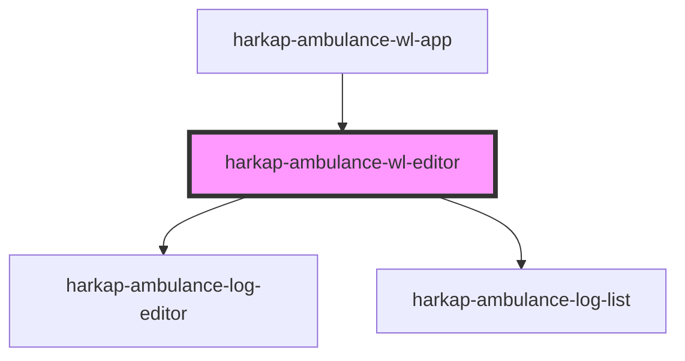

# harkap-ambulance-wl-editor

<!-- Auto Generated Below -->

## Properties

| Property   | Attribute   | Description | Type     | Default     |
| ---------- | ----------- | ----------- | -------- | ----------- |
| `basePath` | `base-path` |             | `string` | `""`        |
| `entryId`  | `entry-id`  |             | `string` | `undefined` |

## Events

| Event           | Description | Type                  |
| --------------- | ----------- | --------------------- |
| `editor-closed` |             | `CustomEvent<string>` |

## Dependencies

### Used by

 - [harkap-ambulance-wl-app](../harkap-ambulance-wl-app)

### Depends on

- [harkap-ambulance-log-editor](../harkap-ambulance-log-editor)
- [harkap-ambulance-log-list](../harkap-ambulance-log-list)

### Graph

----------------------------------------------

*Built with [StencilJS](https://stenciljs.com/)*
